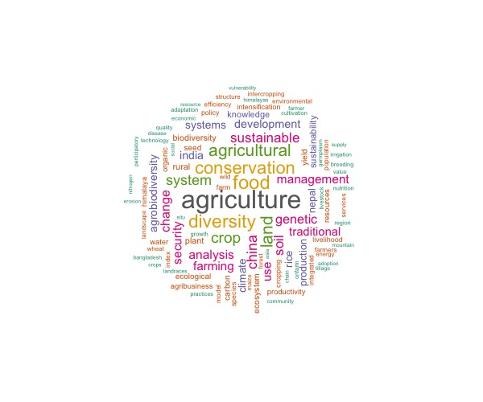
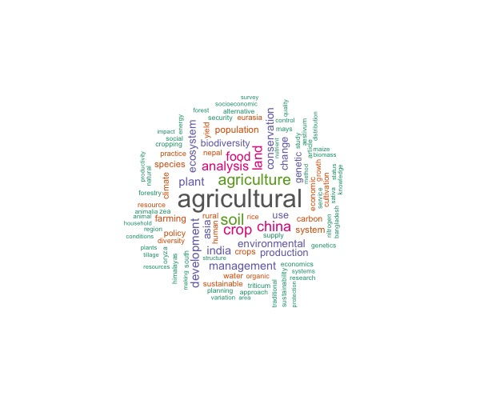

```{r eval=T, echo=F, warning=F, message=F, results='hide'}
source("code/syn_1 - data_organize.r")
library(gt)
```

## Part 1
I have attempted to answer the following questions:

* **1.** Literature distribution by Year.

* **2.** Literature distribution by Country.

* **3.** Key word frequency.

#### Literature distribution by Year
```{r eval=T, echo=F}
names(data.year)[2] <- "Count"
data.year %>% 
  gt()
```

#### Literature distribution by Country
```{r eval=T, echo=F}
data.country %>% 
  gt()
```

#### Key Word Frequency
```{r eval=T, echo=F}
w1.table %>% 
  select(1,2) %>% 
  gt() %>% 
  tab_header(title="Author Keywords")
```




```{r eval=T, echo=F}
w2.table %>%
  select(1,2) %>% 
  gt() %>% 
  tab_header(title="Index Keywords")
````




